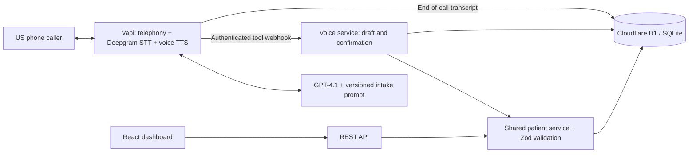

# CareCloud Voice Intake

An AI Engineer assessment implementation: a phone-based patient registration agent, durable SQL records, a validated REST API, and an operations dashboard.

**Demo only. Use fictional details. This is not a production healthcare or HIPAA-compliant system.**

## Submission status

| Deliverable          | Status                                                                                                               |
| -------------------- | -------------------------------------------------------------------------------------------------------------------- |
| Repository           | [github.com/nehaaamir17/carecloud-voice-ai-agent](https://github.com/nehaaamir17/carecloud-voice-ai-agent)           |
| API base URL         | [carecloud-voice-intake-neha.aamirneha73.chatgpt.site](https://carecloud-voice-intake-neha.aamirneha73.chatgpt.site) |
| Dashboard            | Same public origin; patient data requires the separately shared reviewer key                                         |
| US phone number      | **[+1 (772) 256-9450](tel:+17722569450)**                                                                            |
| Reviewer credentials | Shared separately; never committed                                                                                   |

The backend is integration-tested and the Vapi assistant is attached to the listed US number. Real phone audio, pronunciation, interruption handling and Spanish voice quality should still be checked with the [demo script](docs/DEMO.md); a webhook test alone is not a real phone-call test.

## What it does

- Collects all required demographic fields, offers optional information, accepts corrections and produces a complete read-back before saving.
- Separates **prepare** from **confirm**. The call-scoped confirmation token binds approval to the exact validated draft. Corrections and restarts invalidate old tokens.
- Persists the patient and call association atomically. Safe confirmation retries return the same patient instead of inserting another one.
- Recognizes returning patients by phone and date of birth, then asks permission before updating.
- Exposes all five requested patient endpoints, optional filters, structured validation errors and soft deletion.
- Shows patient records, call outcomes, linked transcripts and persistent mock appointment bookings in the dashboard.
- Includes a Spanish-capable voice configuration, generated OpenAPI/Postman artifacts, and automated integration tests using real SQLite.

## Architecture



The last arrow is implemented through the authenticated webhook and voice service, not direct provider database access.

**Stack:** TypeScript, React 19, Vinext/Cloudflare Workers, Zod, Drizzle-generated SQLite migrations, Cloudflare D1, Vapi, Deepgram Nova 3, Vapi multilingual voice, GPT-4.1.

Vapi avoids rebuilding streaming telephony, STT/TTS and turn-taking during a short assessment. D1 offers durable SQL without a separate database account or connection pool. Raw prepared statements keep queries explicit; Drizzle owns schema/migration generation. The voice and REST paths share business logic rather than duplicating validation.

## Local setup

Use **Node.js 24 LTS** (the tests use built-in `node:sqlite`) and npm. Run commands from this repository's root.

```bash
npm ci
cp .env.example .env
```

Set distinct random values of at least 32 characters for `ADMIN_API_KEY` and `VAPI_WEBHOOK_SECRET`. For example, generate each locally with `node -e "console.log(require('crypto').randomBytes(32).toString('hex'))"`. Do not reuse the example placeholders. Copy `.env` to `.dev.vars` for local Worker bindings.

```bash
npm run build
npm run db:migrate:local
npm run dev
```

Open the URL printed by the server (normally `http://localhost:5173`). Unlock the registry using `ADMIN_API_KEY`. Local SQLite state lives under `.wrangler/state` and survives server restarts. Do not delete this directory if you want to retain local records. Production D1 is a separate, platform-managed database.

On PowerShell, use `Copy-Item .env.example .env` and `Copy-Item .env .dev.vars` instead of `cp`. If npm is blocked by corporate certificates, use your organization's trusted CA configuration; do not disable certificate validation. Node 24's `--use-system-ca` can use the Windows trust store.

## Environment variables

| Variable              | Purpose                                                                  |
| --------------------- | ------------------------------------------------------------------------ |
| `ADMIN_API_KEY`       | Reviewer/API access key; required, 32+ characters                        |
| `VAPI_WEBHOOK_SECRET` | Separate provider webhook bearer credential; required for voice          |
| `VAPI_API_KEY`        | Vapi private key; **local provisioning script only**, never browser code |
| `PUBLIC_BASE_URL`     | Public HTTPS origin for provider webhook and smoke tests                 |
| `VAPI_ASSISTANT_ID`   | Provisioned assistant ID; enables deployment readiness display           |
| `VAPI_PHONE_NUMBER`   | Actual provisioned US number in E.164 format                             |
| `LOG_DEMOGRAPHICS`    | `true` logs final synthetic patient payloads to stdout                   |
| `VAPI_MODEL`          | Optional provisioning-only model override; defaults to `gpt-4.1`         |

Hosted runtime values are configured as deployment secrets/environment variables, never placed in `.openai/hosting.json`. `DB` is the logical D1 binding. `.env`, `.dev.vars`, provisioning checkpoints, reviewer credentials and local database files are ignored by Git.

## Activate the phone agent

1. Create a Vapi account, confirm provider/model access and ensure the account can run calls. Phone availability and free-number eligibility depend on the provider/account. Call usage may require credit.
2. Deploy the backend to a public HTTPS origin. Confirm `GET /health` responds and the protected REST API works.
3. Put the Vapi **private** key, public base URL and webhook secret in `.env`.
4. Run `npm run vapi:provision`. The script creates a reusable bearer credential, creates/updates the assistant, requests a Vapi-managed US inbound number, and binds it to the assistant. It does not purchase a paid number or place outbound calls.
5. Copy the returned assistant ID and phone number into the backend environment and redeploy that environment revision. These values are public identifiers, not private keys.
6. Make real calls using [the demo script](docs/DEMO.md). Check registration, correction, return call, silence, interruption, hangup, and Spanish. Verify the same patient UUID after an update.

Provisioning records completed IDs in ignored `provisioning.local.json`. An ambiguous create failure is deliberately not retried automatically; inspect Vapi first and record the resource ID before continuing. If a free number cannot be provisioned, document the provider response and use Vapi's assistant test interface while resolving the number. Do not claim a number works until a call succeeds.

### Integration issues resolved

- The initially requested `202` area code was unavailable from the Vapi-managed free-number inventory. The API returned available alternatives, so provisioning was retried with `772` and the selected number was bound to the same assistant. `VAPI_AREA_CODE` keeps this choice configurable.
- Creating the server bearer credential through the first API payload returned a provider validation error. The credential was created through Vapi's Server Configuration UI, stored only as a provider resource, and referenced by the assistant; neither the credential nor the Vapi private key is committed.
- The first deployment URL was a pre-publication hostname. After the permanent public hostname was assigned, the assistant server URL and hosted environment were updated together, then verified with the live authenticated webhook smoke test.
- GitHub CLI was initially authenticated to a different personal account. The repository was created under the required `nehaaamir17` owner, the final commit author was corrected, and temporary collaborator access used during setup was removed.
- The local Sites archive helper expected Bash/WSL, which was unavailable on this Windows host. The documented portable remote-build path was used instead; the production build, health check, and smoke suite all passed.

These were setup/provider issues rather than application fallbacks. The repository remains runnable locally with SQLite using the instructions above, and the deployed Worker uses D1. A real inbound audio call is still the outstanding manual verification step.

The assistant prompt is in [voice/system-prompt.md](voice/system-prompt.md); its tools and provider configuration are in [voice/assistant.mjs](voice/assistant.mjs). Vapi sends `tool-calls` to `/webhooks/vapi`; each result returns the matching `toolCallId` and a JSON-encoded string. End-of-call reports store the transcript/summary and retain its patient association.

References used for the integration: [Vapi custom tools](https://docs.vapi.ai/tools/custom-tools), [server authentication](https://docs.vapi.ai/server-url/server-authentication), [US phone calling](https://docs.vapi.ai/phone-calling), [multilingual configuration](https://docs.vapi.ai/customization/multilingual), and [supported OpenAI model configuration](https://docs.vapi.ai/providers/model/openai).

## REST API

Use `Authorization: Bearer YOUR_REVIEWER_KEY`. Dates at the API boundary use **MM/DD/YYYY**. The database stores date-only ISO strings for comparison; timestamps are UTC ISO strings. Formatted US phone numbers and a `+1` prefix are normalized to ten digits. Optional fields can be omitted; language defaults to English.

| Method | Path                | Behavior                                                                                                      |
| ------ | ------------------- | ------------------------------------------------------------------------------------------------------------- |
| GET    | `/patients`         | Active patients; optional exact `last_name`, `date_of_birth`, `phone_number` filters; opt-in `limit`/`offset` |
| GET    | `/patients/:id`     | Single active patient by UUID                                                                                 |
| POST   | `/patients`         | Create and return the patient with HTTP 201                                                                   |
| PUT    | `/patients/:id`     | Partial update; optional fields may be cleared with null                                                      |
| DELETE | `/patients/:id`     | Set `deleted_at`; no physical deletion                                                                        |
| GET    | `/health`           | Public DB health and voice configuration state                                                                |
| GET    | `/api/calls`        | Latest 100 calls; optional `patient_id` filter                                                                |
| GET    | `/api/appointments` | Persistent mock appointment bookings                                                                          |

```json
{
  "first_name": "Jane",
  "last_name": "Doe",
  "date_of_birth": "03/15/1990",
  "sex": "Female",
  "phone_number": "2025550142",
  "address_line_1": "123 Example Street",
  "city": "Boston",
  "state": "MA",
  "zip_code": "02108"
}
```

Success: `{ "data": {...}, "error": null }`. List data is an array. Failure: `{ "data": null, "error": { "code": "VALIDATION_ERROR", "message": "...", "fields": [{"field":"phone_number","message":"..."}], "request_id": "..." } }`.

`patient_id`, `created_at`, `updated_at` and `deleted_at` are server-owned and rejected in create/update inputs. Authentication errors use 401, malformed JSON 400, validation 422, missing records 404, state conflicts 409, throttling 429, unexpected failures 500 and service unavailability 503. Valid Vapi tool calls return correlated tool errors with HTTP 200 so the agent can speak a recovery message.

API documentation is at `/docs`; downloadable artifacts are `/openapi.json` and `/postman.json`. In Postman, set `base_url` and `api_key`; Create stores the returned patient ID for subsequent requests.

## Validation and tests

```bash
npm test
npm run typecheck
npm run build
npm run smoke
```

`npm test` executes the production HTTP handler and services against real SQLite with the actual generated migration. It covers the REST lifecycle, every field's validation, malformed bodies, API and webhook authentication, signed cookies/CSRF, optional defaults, corrections, explicit confirmation, restart, dropped calls, returning patients, safe retries, transactional failure recovery, persistence after reopening the DB, and mock booking uniqueness.

`npm run smoke` uses `PUBLIC_BASE_URL` (or localhost) and real HTTP requests. It creates synthetic records, checks validation/filter/update/delete and authenticated voice tool calls, then soft-deletes those records. This is intentionally not described as an audio test. The GitHub Actions workflow runs tests, type checking and a production build.

## Security and trade-offs

- Public origin; patient data is protected with a high-entropy reviewer bearer key or an eight-hour HttpOnly/SameSite signed cookie. Cookie writes require same-origin requests. Webhooks use a different key. There is no user/role management in this assessment.
- SQL uses bound parameters and schema constraints. Validation rejects unknown fields, control characters and markup. Request bodies are bounded. API/login rate buckets persist in SQL; provider webhooks use authentication and provider call limits rather than that shared-IP limiter.
- Names support Unicode letters, hyphens and apostrophes. The assessment's strict name rule intentionally rejects spaces. Phone validation checks a plausible NANP shape, not carrier ownership or geographic assignment. State abbreviations cover 50 states and DC; phone/ZIP/state relationships are not externally verified.
- Phone plus DOB is a demo duplicate-identification measure, **not strong identity authentication**. Real deployments need a stronger identity flow.
- The backend enforces draft/token/state integrity, but it cannot prove that the LLM actually read every field aloud or heard a real “yes.” That requires transcript/audio evaluation. Prompt injection resistance is a prompt/authorization boundary, not a guarantee.
- D1 batches make voice saves transactional. An optimistic check rejects a returning record changed during confirmation. REST partial updates change only submitted fields. Shared household phone numbers remain permitted.
- Unconfirmed drafts never become patients. End-of-call reports clear abandoned drafts; a provider event that never arrives can leave a stale call row. Expired confirmation tokens cannot save without a fresh prepare/read-back.
- Final demo payloads and provider transcripts are logged; recording audio is disabled. There is no production retention/redaction policy yet. Never use real patient information.
- Mock appointments use UTC and a short rolling weekday schedule; they are not connected to an EHR/calendar. Dates and provider audio must be checked in real calls.
- Vinext is a beta framework. The application is deliberately split into framework-independent services so it can move to another HTTP framework. Local previews, cloud database state, and hosted secrets are separate.
- WebMCP adds a progressive-enhancement registry search tool when supported; no compatible validation context was available, so its runtime behavior is not claimed as verified. Normal dashboard/API operation does not depend on it.

## Structure

```text
app/                    Dashboard, API reference and Worker route adapter
components/             Patient UI, call history and status card
lib/validation.ts       Shared demographic schema and normalization
lib/patients.ts         Patient persistence service
lib/voice.ts            Draft/confirmation state machine and Vapi adapter
lib/http.ts             HTTP routes, statuses and envelopes
lib/auth.ts             Reviewer/webhook auth and bounded rate limiting
db/schema.ts            Relational schema and constraints
drizzle/                Generated immutable migrations
voice/                  Versioned system prompt and assistant/tool configuration
scripts/                Provisioning, migration, documentation and smoke helpers
tests/                  Real-SQLite integration tests
docs/                   Requirement traceability and reviewer walkthrough
```

## Next steps

Before the interview review, make one real English call and one Spanish call using fictional details to evaluate pronunciation, interruption handling and carrier audio. For a production healthcare rollout, add organization identity and role authorization, formal retention/redaction and audit policies, backup recovery exercises, provider evaluation datasets, cost/latency alerts and the applicable compliance review.

See [requirements coverage](docs/REQUIREMENTS.md) and [reviewer/interview walkthrough](docs/DEMO.md).
